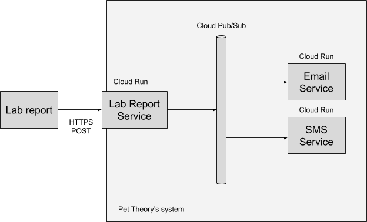

# Build a Resilient, Asynchronous System with Cloud Run and Cloud PubSub



Qwiklabs Quest to illustrate building a resilient, asynchronous system with _Cloud Run_ and _Cloud PubSub_.

Pet Theory would like to automate the process of sharing client test results. They have experienced an increased volume of appointments and so would like to remove the bottleneck of manually administering test results. Instead they would like a system to be able to process the lab results automatically.

The application covers the following activities:

* Create a Lab Report Service
* Create a Communication Service for Email/SMS
* Enable data resiliency
* Test service components

## Steps

- Create a Pub/Sub topic
  
  ```shell script
    gcloud pubsub topics create new-lab-report
  ```

- Enable Cloud Run, which will run your code in the cloud

    ```shell script
    gcloud services enable run.googleapis.com
    ```

### 1. Lab Report Service

- Build the Lab Report Service

    ```shell script
    git clone https://github.com/barbietunnie/cloud-run-pubsub.git

    # Change to working dir
    cd lab-service

    # Install dependencies
    npm install
    ```

- Deploy the lab-report-service

    ```shell script
    chmod u+x deploy.sh
    ./deploy.sh
    ```

- Test the Lab Report Service

    ```shell script
    export LAB_REPORT_SERVICE_URL=$(gcloud run services describe lab-report-service --platform managed --region us-central1 --format="value(status.address.url)")

    echo $LAB_REPORT_SERVICE_URL

    chmod u+x post-reports.sh
    ./post-reports.sh
    ```

    3 lab reports should have been posted to the _Lab Report Service_. Check the `lab-report-service` _Cloud Run logs_ to see the results!


### 2. The Email Service

- Build the Email Service

    ```shell script
    # Move to the Email Service directory
    cd ../email-service

    # Install dependencies
    npm install
    ```

- Deploy the email-service

    ```shell script
    chmod u+x deploy.sh
    ./deploy.sh
    ```

- Configure Pub/Sub to trigger the Email Service

    ```shell script
    # Create a new service account that will be used to trigger the services responding to Pub/Sub messages
    gcloud iam service-accounts create pubsub-cloud-run-invoker --display-name "PubSub Cloud Run Invoker"

    # Give the new service account permission to invoke the Email Service
    gcloud run services add-iam-policy-binding email-service --member=serviceAccount:pubsub-cloud-run-invoker@$GOOGLE_CLOUD_PROJECT.iam.gserviceaccount.com --role=roles/run.invoker --region us-central1 --platform managed

    # Put the project number in an environment variable for easy access
    PROJECT_NUMBER=$(gcloud projects list --filter="qwiklabs-gcp" --format='value(PROJECT_NUMBER)')

    # Enable the project to create Pub/Sub authentication tokens
    gcloud projects add-iam-policy-binding $GOOGLE_CLOUD_PROJECT --member=serviceAccount:service-$PROJECT_NUMBER@gcp-sa-pubsub.iam.gserviceaccount.com --role=roles/iam.serviceAccountTokenCreator

    # Put the URL of the Email Service in another environment variable
    EMAIL_SERVICE_URL=$(gcloud run services describe email-service --platform managed --region us-central1 --format="value(status.address.url)")

    # Confirm the EMAIL_SERVICE_URL has been captured
    echo $EMAIL_SERVICE_URL

    # Create a Pub/Sub subscription for the Email Service
    gcloud pubsub subscriptions create email-service-sub --topic new-lab-report --push-endpoint=$EMAIL_SERVICE_URL --push-auth-service-account=pubsub-cloud-run-invoker@$GOOGLE_CLOUD_PROJECT.iam.gserviceaccount.com

    ```

- Test the Lab Report Service and the Email Service together

    ```shell script
    ./post-reports.sh
    ```

    Check the `email-service` _Cloud Run logs_ on GCP to see the results!


### 3. The SMS Service

- Build the SMS Service

    ```shell script
    # Move to the Email Service directory
    cd ../sms-service

    # Install dependencies
    npm install
    ```

- Deploy the sms-service

    ```shell script
    chmod u+x deploy.sh
    ./deploy.sh
    ```

- Configure Cloud Pub/Sub to trigger the SMS Service

    ```shell script
    # Set the permissions to allow Pub/Sub to trigger the SMS Service
    gcloud run services add-iam-policy-binding sms-service --member=serviceAccount:pubsub-cloud-run-invoker@$GOOGLE_CLOUD_PROJECT.iam.gserviceaccount.com --role=roles/run.invoker --region us-central1 --platform managed

    # Put the URL address of the SMS Service in an environment variable
    SMS_SERVICE_URL=$(gcloud run services describe sms-service --platform managed --region us-central1 --format="value(status.address.url)")

    # Confirm the SMS_SERVICE_URL has been captured
    echo $SMS_SERVICE_URL

    # Create the Pub/Sub subscription
    gcloud pubsub subscriptions create sms-service-sub --topic new-lab-report --push-endpoint=$SMS_SERVICE_URL --push-auth-service-account=pubsub-cloud-run-invoker@$GOOGLE_CLOUD_PROJECT.iam.gserviceaccount.com

    # Run the test script again to post three lab reports to the Lab Report Service
    ../lab-service/post-reports.sh
    ```

    Check the `sms-service` _Cloud Run logs_ on GCP to see the result of this service being triggered by Pub/Sub.

- Test the resiliency of the system

    What happens if one of the services goes down? We will mak the `email-service` fail to simulate this.

    ```shell script
    cd ../email-service
    ```

    Add some invalid text to the Email Service application to cause an error.
    
    Edit `index.js` and add the throw line to the `sendEmail()` function, as shown below. This will throw an exception, as if the email server was down.

    ```shell script
    ...

    function sendEmail() {
        throw 'Email server is down';
        console.log('Sending email');
    }

    ...
    ```

    The addition of this code will crash the service when it is invoked.

    ```shell script
    # Deploy this bad version of the Email Service
    ./deploy.sh

    # After successful deployment of the Email Service, post data to the lab reports again, then go and watch the email-service log status closely
    ../lab-service/post-reports.sh
    ```
    
    Check the `email-service` _Cloud Run logs_ on GCP to see the results! The Email Service is being invoked, but it will keep crashing. If you scroll back a bit in the logs you will find the root cause: “Email server is down”. You can also see that the service returns status code 500, and that Pub/Sub keeps retrying calling the service.

    If you look at the logs from the SMS service, you will see that it operates successfully.

    Now fix the error in the Email Service to restore the application!

    Open the `index.js` file and remove the throw line you previously entered, then save the file and redeploy.

    ```shell script
    ./deploy.sh
    ```

    Pub/Sub keeps retrying until it is finally successful, which is the foundation of a robust system!